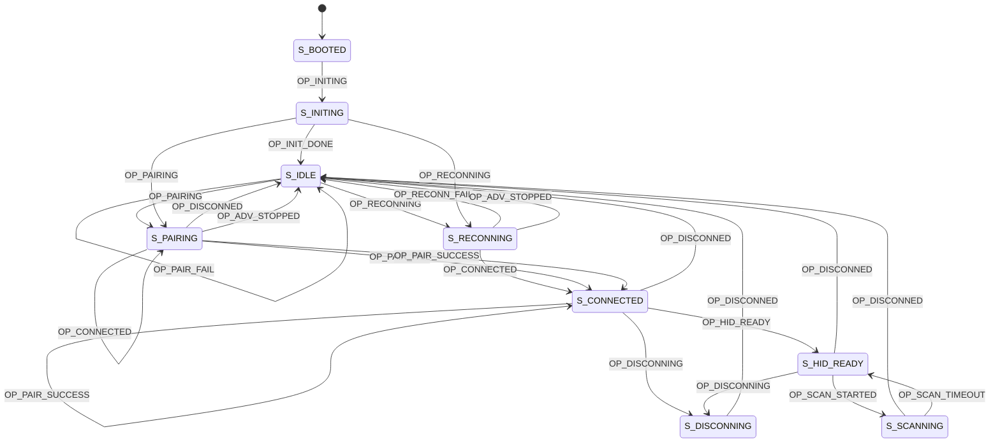
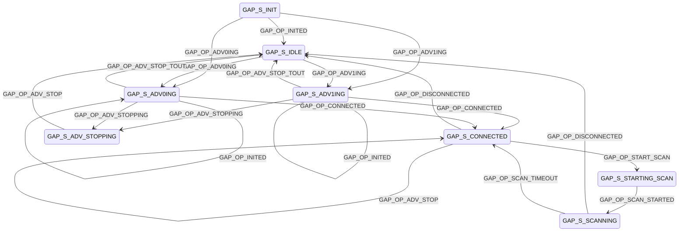

# LunchTrak Scanner

This code is for the "main" LunchTrak scanner. It will be connected to the lunch computer via Bluetooth and will actively scan for LunchTrak beacons. When it detects a beacon with an RSSI above the threshold, it will "type" the number into the computer through HOGP (HID over GATT Protocol)

## To Pair

1. Go to Bluetooth settings on PC/Mac/Linux and "Add a Bluetooth Device".
2. Power on scanner. If already paired, hold the PAIR button (P10) for 3 seconds to reset pairing info
3. Look for and pair "LunchTrak Scanner". It may also appear as a generic "Keyboard" on some devices.

## State Diagram

### Main State Machine

### GAP State Machine

# Notes and TODOs

## TODO:

- Work with peripheral scanner
- Think about state machine and how it might prevent multiple scanning at a time
- Is there something we can do with the knowledge of time interval for proximity?
